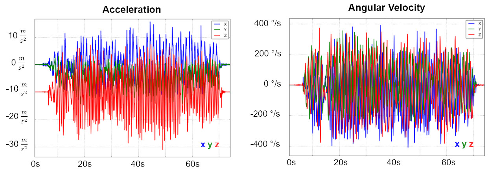
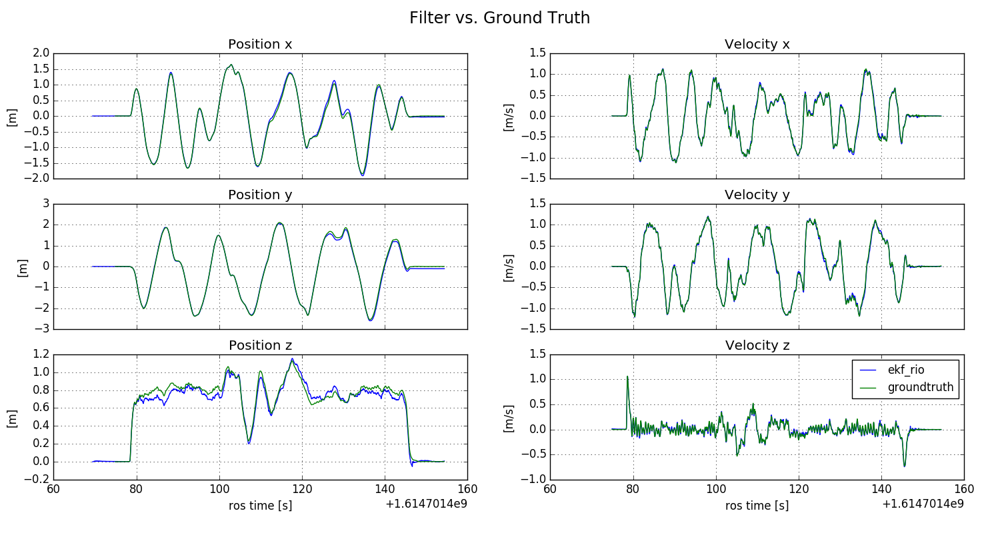
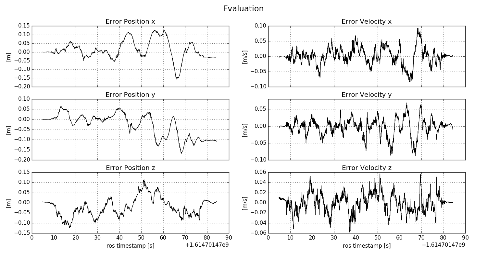

# ekf_rio: Extended Kalman Filter based Radar Inertial Odmetry

This package provides an efficient C++ implementation of EKF-based Radar Inertial Odometry with online calibration of
 the radar sensor extrinsic calibration.
Based on a single radar scan, the 3D radar ego velocity is estimated using the [radar_ego_velocity_estimatior](https://github.com/christopherdoer/reve) package.
Fusion with intertial data is carried out using an Error State EKF.
In addition, barometer measurements can be fused as well for improved z-axis estimation.
We are using the North East Down (NED) convention within our navigation filter.
Thus, the published filter state follows that convention.
The publishers of the pose and twist topics, however, follow the ROS convention [REP-103](https://www.ros.org/reps/rep-0103.html).
Details on the published topics are provided below.

## Cite
If you use ekf_rio for your academic research, please cite our related paper:

~~~[bibtex]
@INPROCEEDINGS{DoerENC2020,
  author={Doer, Christopher and Trommer, Gert F.},
  booktitle={2020 European Navigation Conference (ENC)}, 
  title={Radar Inertial Odometry With Online Calibration}, 
  year={2020},
  pages={1-10},
  doi={10.23919/ENC48637.2020.9317343}}
~~~

## Demo Results
### Autonomous UAV Flights using Radar Inertial Odometry

### Indoor Low Dynamic Dataset

### Indoor High Dynamic Dataset

### Motion Capture Dataset
The dataset [vicon_easy](../demo_datasets/vicon_easy.bag) yields the results below.

It takes only 0.79s to process the dataset vicon_easy (length: 84s) using an Intel NUC i7-8650U (>100 x real-time).

Alignment with the ground truth using the initial pose yields:

***Position error analysis in [m]:***

- Mean error: 0.011, -0.030, -0.022
- Mean absolute error: 0.011, -0.030, -0.022
- Mean error norm: 0.088
- Error STD: 0.054, 0.057, 0.046

***Velocity error analysis in [m/s]:***

- Mean error: 0.001, -0.003, -0.000
- Mean absolute error: 0.020, 0.018, 0.014
- Mean error norm: 0.035
- Error STD: 0.028, 0.025, 0.018

## Getting Started

Run the demo in rosbag mode which also starts rviz for visualization, does an evaluation and generates the analysis
 plots shown above:

~~~[shell]
roslaunch ekf_rio demo_datasets_ekf-rio_rosbag.launch do_plot:=True 
~~~

The results of the most recent main branch might diver a little, the results above have been created with: git checkout c147214.

Run without rviz and plotting:

~~~[shell]
roslaunch ekf_rio demo_datasets_ekf-rio_rosbag.launch do_plot:=False enable_rviz:=False
~~~

Run without radar trigger messages:

~~~[shell]
roslaunch ekf_rio demo_datasets_ekf-rio_rosbag.launch run_without_radar_trigger:=True
~~~

Run in online mode:

~~~[shell]
roslaunch ekf_rio demo_datasets_ekf-rio_ros.launch do_plot:=True 
rosbag play --clock vicon_easy.bag
~~~

## Nodes

Our ekf_rio implementation provides two node for ROS interfacing:
- ***ros_node:*** Subscribes to all topics and does online processing
- ***rosbag_node:*** Reads a rosbag and runs ekf_rio at maximum speed

A set of demo parameters is given in [ekf_rio_default](./config/ekf_rio_default.yaml).
Most of the parameters can be changed online using rqt_reconfigure. Further documentation of the parameters can be found using the tooltip text in rqt_reconfigure and in the python files, see [cfg](./cfg).

Published topics are the same for both modes:
- ~state ([ekf_rio/EkfRioState](../ekf_rio/msg/EkfRioState.msg)): full filter state (NED-convention)
- ~covariance ([ekf_rio/EkfRioCovariance](../ekf_rio/msg/EkfRioCovariance.msg)): diagonal elements of covariance matrix
- ~pose ([geometry_msgs/PoseStamped](http://docs.ros.org/en/api/geometry_msgs/html/msg/PoseStamped.html])): pose (ROS convention)
- ~twist ([geometry_msgs/TwistStamped](http://docs.ros.org/en/api/geometry_msgs/html/msg/TwistStamped.html])): twist (ROS convention)
- ~pose_path ([nav_msgs/Path](http://docs.ros.org/en/api/nav_msgs/html/msg/Path.html)): pose path (ROS convention)
- ~radar_scan_inlier ([sensor_msgs/PointCloud2](http://docs.ros.org/en/api/sensor_msgs/html/msg/PointCloud2.html)): radar scan inlier used for velocity estimation

## ti_mmwave_rospkg Support

The standard format of the ti_mmwave_rospkg (version 3.3.0) is also supported.

Run the demo with radar trigger signal:

~~~[shell]
roslaunch ekf_rio ti_mmwave_ekf-rio_rosbag.launch run_without_radar_trigger:=False
~~~

Run the demo without radar trigger signal:

~~~[shell]
roslaunch ekf_rio ti_mmwave_ekf-rio_rosbag.launch run_without_radar_trigger:=True
~~~

# Run the custom demo without radar trigger signal using only 1 radar: 
**Note:** Currently only ekf_rio package supports non-triggred radar signal, some modifications in y_rio and x_rio are needed to get a workaround

~~~[shell]
roslaunch ekf_rio ti_mmwave_ekf-rio_rosbag_custom.launch enable_rviz:=True type:=ros_node do_plot:=false run_without_radar_trigger:=True
~~~
two main config files used are in `ekf_rio/config/ekf_rio_custom.yaml` and  `demo_datasets/ekf_rio/`

check odometry data on 
~~~[shell]
rostopic echo /ekf_rio/pose_path
~~~
