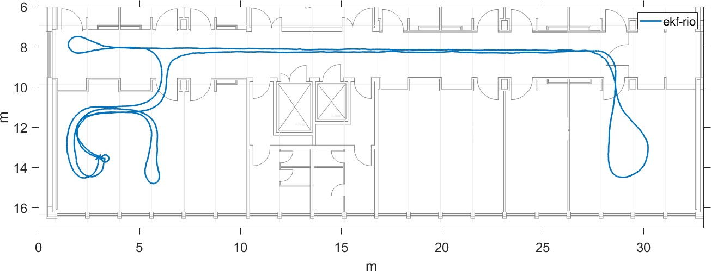

# ekf_rio: Extended Kalman Filter based Radar Inertial Odmetry

This package provides an efficient C++ implementation of EKF-based Radar Inertial Odometry with online calibration of
 the radar sensor extrinsic calibration.
Based on a single radar scan, the 3D radar ego velocity is estimated using the [radar_ego_velocity_estimation](../radar_ego_velocity_estimation) package.
Fusion with intertial data is carried out using an Error State EKF.
In addition, barometer measurements can be fuses as well for improved z-axis estimation.
We are using the North East Down (NED) convention.
Thus, the z-axis points downwards.

## Cite
If you use ekf_rio for your academic research, please cite our related paper:

~~~[bibtex]
@INPROCEEDINGS{DoerENC2020,
  author={Doer, Christopher and Trommer, Gert F.},
  booktitle={2020 European Navigation Conference (ENC)}, 
  title={Radar Inertial Odometry With Online Calibration}, 
  year={2020},
  pages={1-10},
  doi={10.23919/ENC48637.2020.9317343}}
~~~

## Demo Results
### Autonomous UAV Flights using Radar Inertial Odometry

### Indoor Low Dynamic Dataset

### Indoor High Dynamic Dataset

### Motion Capture Dataset
The dataset [vicon_easy](../demo_datasets/vicon_easy.bag) yields the results below.

It takes only 0.79s to process the dataset vicon_easy (length: 84s) using an Intel NUC i7-8650U (>100 x real-time).

Alignment with the ground truth using the initial pose yields:

***Position error analysis in [m]:***

- Mean error: 0.011, -0.030, -0.022
- Mean absolute error: 0.011, -0.030, -0.022
- Mean error norm: 0.088
- Error STD: 0.054, 0.057, 0.046

***Velocity error analysis in [m/s]:***

- Mean error: 0.001, -0.003, -0.000
- Mean absolute error: 0.020, 0.018, 0.014
- Mean error norm: 0.035
- Error STD: 0.028, 0.025, 0.018

## Getting Started

Run the demo in rosbag mode which also starts rviz for visualization, does an evaluation and generates the analysis
 plots shown above:

~~~[shell]
roslaunch ekf_rio demo_datasets_ekf-rio_rosbag.launch do_plot:=True 
~~~

Run without rviz and plotting:

~~~[shell]
roslaunch ekf_rio demo_datasets_ekf-rio_rosbag.launch do_plot:=False enable_rviz:=False
~~~

Run in online mode:

~~~[shell]
roslaunch ekf_rio demo_datasets_ekf-rio_ros.launch do_plot:=True 
rosbag play --clock vicon_easy.bag
~~~

## Nodes

Our ekf_rio implementation provides two node for ROS interfacing:
- ***ros_node:*** Subscribes to all topics and does online processing
- ***rosbag_node:*** Reads a rosbag and runs ekf_rio at maximum speed

A set of demo parameters is given in [ekf_rio_default](./config/ekf_rio_default.yaml).
Most of the parameters can be changed online using rqt_reconfigure. Further documentation of the parameters can be
 found using the tooltip text in rqt_reconfigure and in the python files, see [cfg](./cfg).